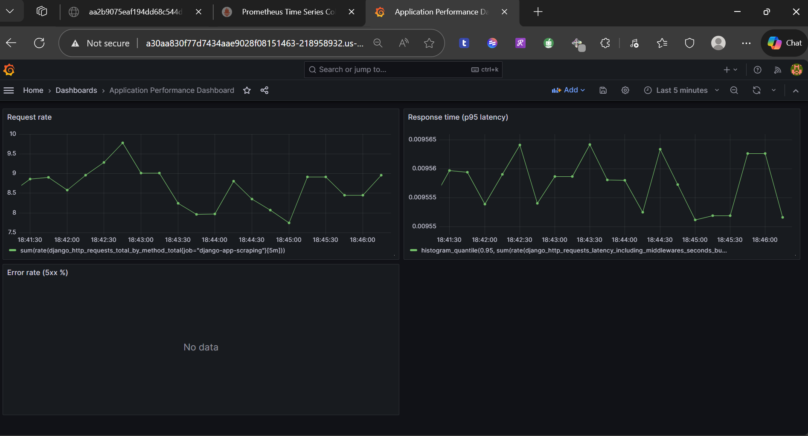
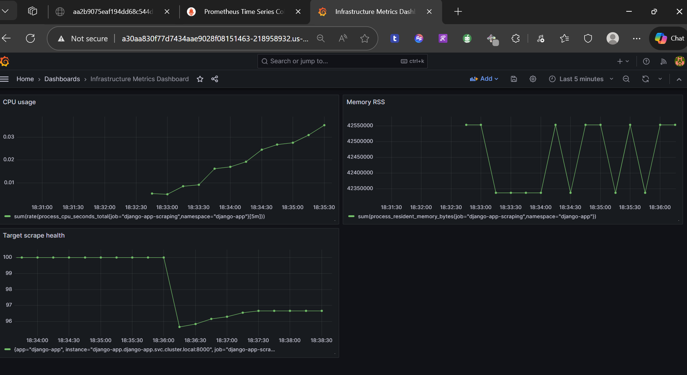

# Highly Available Django Application Platform on AWS

## Overview

A production-ready, highly available Infrastructure as Code (IaC) solution for deploying Django web applications on AWS. This platform showcases enterprise-grade infrastructure automation using both Terraform and CloudFormation, featuring multi-tier architecture, automated scaling, comprehensive monitoring, and security best practices.

**Key Features:**
- Multi-AZ deployment for high availability and fault tolerance
- Auto-scaling based on CPU utilization (70% threshold)
- Automated Django application deployment with Gunicorn and Nginx
- PostgreSQL RDS database with Multi-AZ failover
- Application Load Balancer with health checks
- VPC with public, private, and database subnet tiers
- CloudWatch monitoring with SNS email alerts
- Kubernetes (EKS) deployment with Helm charts
- Observability stack with Prometheus and Grafana
- Horizontal Pod Autoscaling for containerized workloads
- Systems Manager Session Manager for secure instance access
- CI/CD ready with GitHub Actions for Docker builds

## Architecture

### AWS Architecture Diagram


### Design Decisions

**Network Segmentation**: I chose a 3-tier architecture with clear separation:
- Public subnets for internet-facing resources (ALB, Bastion)
- Private subnets for application instances (Django apps)
- Database subnets for RDS (isolated from application tier)

**High Availability**: Multi-AZ deployment across 2 availability zones with:
- Auto Scaling Group (2-3 instances, CPU-based scaling at 70%)
- RDS Multi-AZ for database failover
- Redundant NAT Gateways for outbound connectivity

**Security**: Implemented defense-in-depth with security groups following least privilege:
- ALB accepts HTTP/HTTPS from internet
- Apps only accept traffic from ALB
- Database only accepts connections from apps
- Bastion provides secure SSH access

## Quick Start

### Prerequisites

**For EC2 Deployment:**
- AWS CLI configured with appropriate permissions
- Terraform 1.0+ or AWS CLI for CloudFormation
- EC2 Key Pair created in target region (optional)

**For Kubernetes Deployment:**
- Docker installed locally
- kubectl configured
- eksctl or AWS CLI with EKS permissions
- Helm 3.x for chart deployment

### Terraform Deployment
```bash
git clone https://github.com/cognetiks/Technical_DevOps_app.git
cd Technical_DevOps_app/terraform

# Configure your settings
cp terraform.tfvars.example terraform.tfvars
# Edit terraform.tfvars with your key pair name and email

terraform init
terraform validate
terraform plan
terraform apply
```

### CloudFormation Deployment

#### Step 1: Create Deployment Role (First Time Only)
```bash
cd Technical_DevOps_app/cloudformation

# Create IAM role with necessary permissions
aws cloudformation create-stack \
  --stack-name django-deployment-role \
  --template-body file://deployment-role.yaml \
  --capabilities CAPABILITY_NAMED_IAM \
  --region us-east-1

# Wait for role creation
aws cloudformation wait stack-create-complete --stack-name django-deployment-role
```

#### Step 2: Configure Parameters
Edit `parameters.json` with your settings:
```json
[
  {
    "ParameterKey": "Environment",
    "ParameterValue": "production"
  },
  {
    "ParameterKey": "NotificationEmail",
    "ParameterValue": "your-email@example.com"
  },
  {
    "ParameterKey": "InstanceType",
    "ParameterValue": "t2.micro"
  },
  {
    "ParameterKey": "DBInstanceClass",
    "ParameterValue": "db.t3.micro"
  }
]
```

#### Step 3: Deploy Infrastructure
```bash
# Deploy with rollback disabled (keeps successful resources on failure)
aws cloudformation create-stack \
  --stack-name django-app-infrastructure \
  --template-body file://main-template.yaml \
  --parameters file://parameters.json \
  --capabilities CAPABILITY_IAM \
  --disable-rollback \
  --region us-east-1

# Monitor deployment progress
aws cloudformation describe-stack-events \
  --stack-name django-app-infrastructure \
  --max-items 20
```

#### Step 4: Verify Deployment
```bash
# Get stack outputs
aws cloudformation describe-stacks \
  --stack-name django-app-infrastructure \
  --query 'Stacks[0].Outputs'

# Test application
ALB_DNS=$(aws cloudformation describe-stacks \
  --stack-name django-app-infrastructure \
  --query 'Stacks[0].Outputs[?OutputKey==`ALBDNSName`].OutputValue' \
  --output text)

curl -I http://$ALB_DNS/health/
```

## Configuration

### Terraform Variables
```hcl
# terraform.tfvars
aws_region = "us-east-1"
environment = "production"
key_name = "your-ec2-key-pair"
notification_email = "example@example.com"
```

**Advanced Configuration**: Each module includes `terraform.tfvars.example` for customizing instance types, scaling parameters, and network settings.

### Infrastructure Structure

#### Terraform Modules
```
terraform/
├── main.tf                 # Root orchestration and module integration
├── variables.tf            # Input variables and defaults
├── outputs.tf             # Infrastructure outputs (ALB DNS, RDS endpoint)
├── terraform.tfvars       # Environment-specific configuration
└── modules/
    ├── vpc/               # VPC, subnets, route tables, NAT gateways
    ├── networking/        # Security groups for ALB, apps, RDS, bastion
    ├── asg/               # Launch template, Auto Scaling Group, bastion host
    ├── alb/               # Application Load Balancer, target groups, listeners
    ├── rds/               # PostgreSQL database, subnet groups, Multi-AZ
    ├── S3/               # S3 bucket for static files and logs
    └── cloudwatch/        # CloudWatch alarms, SNS topics, monitoring
```

#### CloudFormation Templates
```
cloudformation/
├── main-template.yaml      # Complete infrastructure stack (all resources)
├── deployment-role.yaml    # IAM role with deployment permissions
├── parameters.json         # Stack parameters (environment, instance types)
└── README.md              # CloudFormation-specific documentation
```

## Infrastructure Details

### Networking Architecture (VPC: 10.0.0.0/16)

**Public Subnets** (Internet-facing resources):
- 10.0.1.0/24 (us-east-1a) - Application Load Balancer, Bastion Host
- 10.0.2.0/24 (us-east-1b) - Application Load Balancer (Multi-AZ)
- Internet Gateway for inbound/outbound internet access
- Route: 0.0.0.0/0 → Internet Gateway

**Private Subnets** (Application tier):
- 10.0.10.0/24 (us-east-1a) - Django application instances
- 10.0.11.0/24 (us-east-1b) - Django application instances (Multi-AZ)
- NAT Gateways in each AZ for outbound internet access
- Route: 0.0.0.0/0 → NAT Gateway (per AZ)

**Database Subnets** (Data tier):
- 10.0.20.0/24 (us-east-1a) - RDS PostgreSQL primary
- 10.0.21.0/24 (us-east-1b) - RDS PostgreSQL standby (Multi-AZ)
- No internet access (fully isolated)
- Only accessible from application subnets

### Compute Resources

**EC2 Instances**:
- **AMI**: Ubuntu 22.04 LTS (ami-0c02fb55956c7d316)
- **Instance Type**: t2.micro (configurable)
- **Auto Scaling**: Min: 1, Desired: 2, Max: 3
- **Scaling Policy**: Target tracking at 70% CPU utilization
- **Health Checks**: ELB health checks with 300s grace period

**Application Stack**:
- **Django**: Deployed from GitHub repository
- **Gunicorn**: WSGI server (3 workers, port 8000)
- **Nginx**: Reverse proxy and static file serving (port 80)
- **Python**: 3.10+ with virtual environment
- **Health Endpoint**: `/health/` returns 200 OK

**Bastion Host**:
- Single t2.micro instance in public subnet
- SSH access via Systems Manager Session Manager (no key required)
- Used for troubleshooting and database access

### Load Balancing

**Application Load Balancer**:
- **Type**: Internet-facing, application layer (Layer 7)
- **Subnets**: Deployed across 2 public subnets (Multi-AZ)
- **Health Check**: HTTP GET /health/ every 30s
- **Thresholds**: 2 healthy, 2 unhealthy checks
- **Timeout**: 5 seconds
- **Listener**: HTTP port 80 (HTTPS can be added with ACM certificate)

### Database

**RDS PostgreSQL**:
- **Engine**: PostgreSQL 16.4
- **Instance Class**: db.t3.micro (1 vCPU, 1GB RAM)
- **Storage**: 100GB GP2 SSD
- **Multi-AZ**: Enabled (automatic failover to standby)
- **Backup**: 7-day retention, automated daily backups
- **Maintenance**: Automated patching during maintenance window
- **Credentials**: postgres/Admin123! (use Secrets Manager in production)
- **Database Name**: postgresDB
- **Port**: 5432
- **Encryption**: At rest (recommended for production)

### Storage

**S3 Bucket**:
- **Purpose**: Static files, media uploads, application logs
- **Naming**: `{environment}-django-static-{account-id}`
- **Access**: Private (public access blocked)
- **Versioning**: Disabled (enable for production)
- **Lifecycle**: Not configured (add for cost optimization)

### Monitoring & Alerting

**CloudWatch (EC2 Deployment)**:
- **High CPU Alarm**: Triggers at 80% average CPU over 10 minutes
- **Auto Scaling Events**: Monitors scale-up/scale-down activities
- **Target Health**: Monitors unhealthy targets in ALB
- **SNS Notifications**: Email alerts for critical alarms

**Prometheus & Grafana (Kubernetes Deployment)**:
- **Prometheus**: Metrics collection and time-series database
  - Scrapes Django metrics from `django-app.django-app.svc.cluster.local:8000/metrics` (`job="django-app-scraping"`)
  - Scrapes Prometheus self-metrics from `localhost:9090`
  - Stores application/process metrics (HTTP, DB, CPU, memory RSS, scrape health)
  - Configurable alerting rules
- **Grafana**: Visualization and dashboards
  - Prometheus datasource is provisioned via `k8s/grafana-datasource-config.yaml`
  - Dashboard queries in this README target `job="django-app-scraping"`
  - Application and infrastructure (process-level) dashboards
  - Custom alerting with multiple notification channels
  - Access via port-forward: `kubectl port-forward -n monitoring svc/grafana 3000:3000`

**SSM Parameter Store**:
- `/DjangoApp/rds_endpoint` - RDS database endpoint
- Used by EC2 instances for dynamic configuration

**VPC Endpoints** (Private connectivity):
- `com.amazonaws.{region}.ssm` - Systems Manager
- `com.amazonaws.{region}.ssmmessages` - Session Manager
- `com.amazonaws.{region}.ec2messages` - EC2 messaging
- Enables Session Manager without internet access

## Testing & Validation

### Application Access
```bash
# Get ALB endpoint
terraform output alb_dns_name

# Test application
curl -I http://<alb-dns-name>/
```

### Infrastructure Health
```bash
# Check target group health
aws elbv2 describe-target-health --target-group-arn <arn>

# Monitor Auto Scaling
aws autoscaling describe-auto-scaling-groups --auto-scaling-group-names <name>
```

### Troubleshooting

#### Common Issues and Solutions

**1. 502 Bad Gateway / Unhealthy Targets**
```bash
# Check target health
aws elbv2 describe-target-health --target-group-arn <arn>

# Connect to instance via Session Manager
aws ssm start-session --target <instance-id>

# Check Gunicorn status
sudo systemctl status gunicorn
sudo journalctl -u gunicorn -n 50

# Check Nginx status
sudo systemctl status nginx
sudo tail -f /var/log/nginx/error.log

# Test health endpoint locally
curl http://localhost/health/
```

**2. Instances Not Registering with ALB**
- Verify security group allows ALB → App on port 80
- Check health check path matches `/health/`
- Ensure Nginx is listening on port 80
- Wait for health check grace period (300s)

**3. Database Connection Failures**
```bash
# Verify RDS endpoint
aws ssm get-parameter --name /DjangoApp/rds_endpoint

# Test database connectivity from instance
psql -h <rds-endpoint> -U postgres -d postgresDB

# Check security group allows app → RDS on port 5432
aws ec2 describe-security-groups --group-ids <rds-sg-id>
```

**4. Auto Scaling Not Working**
```bash
# Check scaling policy
aws autoscaling describe-policies --auto-scaling-group-name <asg-name>

# View scaling activities
aws autoscaling describe-scaling-activities --auto-scaling-group-name <asg-name>

# Check CloudWatch metrics
aws cloudwatch get-metric-statistics \
  --namespace AWS/EC2 \
  --metric-name CPUUtilization \
  --dimensions Name=AutoScalingGroupName,Value=<asg-name> \
  --start-time 2024-01-01T00:00:00Z \
  --end-time 2024-01-01T23:59:59Z \
  --period 300 \
  --statistics Average
```

**5. CloudFormation Stack Failures**
```bash
# View failed events
aws cloudformation describe-stack-events \
  --stack-name django-app-infrastructure \
  --query 'StackEvents[?ResourceStatus==`CREATE_FAILED`]'

# Continue deployment after fixing issues
aws cloudformation continue-update-rollback \
  --stack-name django-app-infrastructure

# Delete failed stack (keeps resources with DeletionPolicy: Retain)
aws cloudformation delete-stack --stack-name django-app-infrastructure
```

**6. Session Manager Connection Issues**
- Ensure VPC endpoints are created in private subnets
- Verify security group allows HTTPS (443) from VPC CIDR
- Check IAM instance profile has SSM permissions
- Install Session Manager plugin: `aws ssm start-session --target <instance-id>`

## Design Considerations

### What I Implemented
- **Modular Terraform**: Reusable modules for different environments
- **Security Best Practices**: Least privilege access, network segmentation
- **High Availability**: Multi-AZ deployment with automated failover
- **Monitoring**: Comprehensive CloudWatch integration
- **Cost Optimization**: Right-sized instances for development workloads

### Production Improvements
For a production deployment, I would recommend:
- AWS Secrets Manager for database credentials
- VPC Flow Logs for network monitoring
- RDS encryption at rest
- WAF protection for the ALB
- Systems Manager Session Manager instead of bastion hosts
- Container deployment with ECS/Fargate for better scalability

### Cost Considerations

**Monthly Cost Estimate** (us-east-1, on-demand pricing):
- **EC2 Instances**: 2x t2.micro = ~$17/month ($0.0116/hour × 2 × 730 hours)
- **RDS Multi-AZ**: db.t3.micro = ~$30/month ($0.041/hour × 730 hours)
- **Application Load Balancer**: ~$23/month ($0.0225/hour × 730 hours + $0.008/LCU)
- **NAT Gateways**: 2x = ~$66/month ($0.045/hour × 2 × 730 hours)
- **Data Transfer**: ~$5/month (first 1GB free, $0.09/GB after)
- **S3 Storage**: ~$1/month (first 50GB at $0.023/GB)
- **CloudWatch**: ~$3/month (10 alarms at $0.10/alarm + logs)
- **VPC Endpoints**: 3x = ~$22/month ($0.01/hour × 3 × 730 hours)

**Total**: ~$167/month

**Cost Optimization Tips**:
- Use single NAT Gateway instead of 2 (saves ~$33/month, reduces HA)
- Use t3.micro instead of t2.micro (better performance, similar cost)
- Enable S3 lifecycle policies to archive old logs
- Use Reserved Instances for 1-year commitment (save ~40%)
- Consider AWS Savings Plans for flexible commitment
- Remove VPC endpoints if using public internet for SSM

## Cleanup

### Terraform Cleanup
```bash
cd terraform/

# Preview resources to be destroyed
terraform plan -destroy

# Destroy all resources
terraform destroy -auto-approve

# Verify all resources are deleted
terraform show
```

### CloudFormation Cleanup
```bash
# Delete main infrastructure stack
aws cloudformation delete-stack --stack-name django-app-infrastructure

# Wait for deletion to complete
aws cloudformation wait stack-delete-complete --stack-name django-app-infrastructure

# Delete deployment role (optional)
aws cloudformation delete-stack --stack-name django-deployment-role

# Verify stacks are deleted
aws cloudformation list-stacks --stack-status-filter DELETE_COMPLETE
```

### Manual Cleanup (if needed)
```bash
# Delete retained resources (RDS, S3, VPC)
aws rds delete-db-instance --db-instance-identifier production-django-postgres --skip-final-snapshot
aws s3 rb s3://production-django-static-<account-id> --force

# Delete SSM parameters
aws ssm delete-parameter --name /DjangoApp/rds_endpoint

# Delete CloudWatch log groups
aws logs delete-log-group --log-group-name /aws/ec2/django-app
```

## Kubernetes Deployment (EKS)

### Prerequisites for EKS
- Docker installed locally
- kubectl configured
- eksctl or AWS CLI with EKS permissions
- Helm 3.x (optional but recommended)

### EKS Cluster Setup
```bash
# Create EKS cluster
eksctl create cluster --name django-app --region us-east-1 --nodegroup-name django-workers --node-type t3.medium --nodes 2 --nodes-min 1 --nodes-max 2 --managed
```

### Docker Containerization
```bash
# Build Django application image
docker build -t cognetiks_django_app:v2 .

# Tag and push to Docker Hub
docker login
docker tag cognetiks_django_app:v2 <your-dockerhub-username>/cognetiks_django_app:v2
docker push <your-dockerhub-username>/cognetiks_django_app:v2
```

### Kubernetes Deployment
```bash
# Deploy application using Helm values file (recommended)
helm upgrade --install django-app helm/django-app/ \
  -f helm/django-app/values.yaml \
  --create-namespace \
  --namespace django-app

# Optional: override image repository/tag during deploy
helm upgrade --install django-app helm/django-app/ \
  -f helm/django-app/values.yaml \
  --set image.repository=<your-dockerhub-username>/cognetiks_django_app \
  --set image.tag=v2 \
  --namespace django-app

# Verify deployment
kubectl get pods,svc,hpa -n django-app

# View Helm release
helm list -n django-app
```

### Kubernetes Resources Structure
```
helm/
└── django-app/                 # Helm chart for Django application
    ├── Chart.yaml              # Chart metadata and version
    ├── values.yaml             # Default configuration values
    ├── .helmignore             # Files to ignore when packaging
    ├── charts/                 # Chart dependencies (if any)
    └── templates/              # Kubernetes manifest templates
        ├── deployment.yaml     # Django app deployment
        ├── service.yaml        # ClusterIP/LoadBalancer service
        ├── ingress.yaml        # ALB ingress controller
        ├── hpa.yaml            # Horizontal Pod Autoscaler
        ├── serviceaccount.yaml # Service account for pods
        ├── _helpers.tpl        # Template helpers and functions
        ├── NOTES.txt           # Post-installation notes
        └── tests/              # Helm chart tests

k8s/                            # Monitoring stack manifests
├── prometheus-config.yaml      # Prometheus configuration
├── prometheus-deployment.yaml  # Prometheus deployment
├── grafana-datasource-config.yaml  # Grafana data source
├── grafana-deployment.yaml     # Grafana deployment
└── grafana-dashboard-django-app.json # Importable Grafana dashboard
```

### Helm Chart Configuration
Edit `helm/django-app/values.yaml` to customize:
```yaml
image:
  repository: franklynux/cognetiks_django_app
  tag: "v2"
  pullPolicy: Always

replicaCount: 3

service:
  type: LoadBalancer
  port: 8000

autoscaling:
  enabled: true
  minReplicas: 2
  maxReplicas: 5
  targetCPUUtilizationPercentage: 80

ingress:
  enabled: false
```

### Monitoring Setup
```bash
# Deploy Prometheus
kubectl create namespace monitoring --dry-run=client -o yaml | kubectl apply -f -
kubectl apply -f k8s/prometheus-config.yaml
kubectl apply -f k8s/prometheus-deployment.yaml

# Deploy Grafana
kubectl apply -f k8s/grafana-datasource-config.yaml
kubectl apply -f k8s/grafana-deployment.yaml

# Verify monitoring stack deployment
kubectl get pods -n monitoring

# Access Grafana
kubectl port-forward -n monitoring svc/grafana 3000:3000
# Default credentials: admin/admin

# Import the provided dashboard JSON from this repo:
# Dashboards -> Import -> Upload k8s/grafana-dashboard-django-app.json
```

### Grafana Dashboards

#### Application Performance Dashboard


*Metrics: Request rate, response time (p95 latency), error rate (5xx %).*

```promql
sum(rate(django_http_requests_total_by_method_total{job="django-app-scraping"}[5m]))

histogram_quantile(0.95, sum(rate(django_http_requests_latency_including_middlewares_seconds_bucket{job="django-app-scraping"}[5m])) by (le))

100 * sum(rate(django_http_responses_total_by_status_total{job="django-app-scraping",status=~"5.."}[5m])) / clamp_min(sum(rate(django_http_responses_total_by_status_total{job="django-app-scraping"}[5m])), 1e-9)
```

#### Infrastructure Metrics Dashboard


*Metrics: CPU usage, memory RSS, target scrape health.*

```promql
sum(rate(process_cpu_seconds_total{job="django-app-scraping",namespace="django-app"}[5m]))

sum(process_resident_memory_bytes{job="django-app-scraping",namespace="django-app"})

100 * avg_over_time(up{job="django-app-scraping",namespace="django-app"}[5m])
```

### Helm Chart Management
```bash
# Upgrade release with new values
helm upgrade django-app helm/django-app/ \
  --set image.tag=v2.0 \
  --namespace django-app

# Rollback to previous version
helm rollback django-app 1 --namespace django-app

# Uninstall release
helm uninstall django-app --namespace django-app

# Package chart for distribution
helm package helm/django-app/
```

### Scaling and High Availability
```bash
# Check HPA status
kubectl get hpa -n django-app

# Manual scaling (if needed)
kubectl scale deployment django-app --replicas=5 -n django-app

# View scaling events
kubectl describe hpa django-app -n django-app

# Check pod distribution across nodes
kubectl get pods -n django-app -o wide
```

### Application Access
```bash
# Get service endpoint
kubectl get svc -n django-app

# Get ingress endpoint (if configured)
kubectl get ingress -n django-app

# Test application
curl -I http://<service-endpoint>/
curl -I http://<service-endpoint>/metrics
```

### Troubleshooting EKS
```bash
# Check pod logs
kubectl logs -f deployment/django-app -n django-app

# Debug pod issues
kubectl describe pod <pod-name> -n django-app

# Check cluster nodes
kubectl get nodes -o wide

# Monitor resource usage
kubectl top pods -n django-app
```

## Security Best Practices

### Implemented Security Measures
- **Network Isolation**: 3-tier architecture with security groups
- **Least Privilege**: Security groups allow only required ports
- **Private Subnets**: Application and database not directly accessible from internet
- **Session Manager**: Secure instance access without SSH keys or bastion hosts
- **S3 Encryption**: Public access blocked on all buckets
- **Multi-AZ**: High availability and fault tolerance

### Production Security Enhancements
```bash
# Use AWS Secrets Manager for database credentials
aws secretsmanager create-secret \
  --name django-db-credentials \
  --secret-string '{"username":"postgres","password":"<strong-password>"}'

# Enable RDS encryption at rest
aws rds modify-db-instance \
  --db-instance-identifier production-django-postgres \
  --storage-encrypted \
  --apply-immediately

# Enable VPC Flow Logs
aws ec2 create-flow-logs \
  --resource-type VPC \
  --resource-ids <vpc-id> \
  --traffic-type ALL \
  --log-destination-type cloud-watch-logs \
  --log-group-name /aws/vpc/flowlogs

# Add WAF to ALB
aws wafv2 associate-web-acl \
  --web-acl-arn <waf-acl-arn> \
  --resource-arn <alb-arn>
```

## CI/CD Pipeline

### GitHub Actions Workflow
Automated Docker image builds on push and pull requests to `main`:

```yaml
# .github/workflows/docker-build.yml
name: Build & Push Docker Image

on:
  push:
    branches: [main]
  pull_request:
    branches: [main]

jobs:
  build:
    runs-on: ubuntu-latest
    steps:
      - uses: actions/checkout@v4
      - uses: docker/setup-buildx-action@v3
      - uses: docker/login-action@v3
        with:
          username: ${{ secrets.DOCKERHUB_USERNAME }}
          password: ${{ secrets.DOCKERHUB_TOKEN }}
      - uses: docker/build-push-action@v5
        with:
          context: .
          push: true
          tags: |
            ${{ secrets.DOCKERHUB_USERNAME }}/cognetiks_django_app:v2
            ${{ secrets.DOCKERHUB_USERNAME }}/cognetiks_django_app:latest
          cache-from: type=gha
          cache-to: type=gha,mode=max
```

### Required GitHub Secrets
- `DOCKERHUB_USERNAME`: Docker Hub username
- `DOCKERHUB_TOKEN`: Docker Hub access token

## Assessment Notes

This implementation demonstrates:

**Infrastructure as Code Excellence**:
- Modular, reusable Terraform modules
- Complete CloudFormation templates with parameter validation
- Version-controlled infrastructure with Git
- DRY principles and best practices

**AWS Cloud Architecture**:
- Multi-tier VPC design with proper subnet segmentation
- High availability across multiple Availability Zones
- Auto Scaling based on CloudWatch metrics
- Load balancing with health checks
- Managed database with automated backups

**Security & Compliance**:
- Defense-in-depth with security groups
- Private subnets for application and database tiers
- Session Manager for secure access without SSH keys
- IAM roles with least privilege permissions

**DevOps & Automation**:
- Automated application deployment via user data
- CI/CD pipeline with GitHub Actions
- Docker containerization for portability
- Infrastructure monitoring and alerting

**Operational Excellence**:
- Comprehensive documentation
- Troubleshooting guides and runbooks
- Cost optimization recommendations
- Production-ready improvements identified

**Technologies Demonstrated**:
- AWS: VPC, EC2, ALB, RDS, S3, CloudWatch, SNS, SSM, IAM
- IaC: Terraform, CloudFormation
- Application: Django, Gunicorn, Nginx, PostgreSQL
- Containers: Docker, Kubernetes (EKS)
- CI/CD: GitHub Actions
- Monitoring: CloudWatch, Prometheus, Grafana

---

**Author**: Franklyn Mbelu 
**Contact**: franklynmbelu@gmail.com
**Repository**: https://github.com/franklynux/aws-django-ha-platform 
**Date**: January 2025
